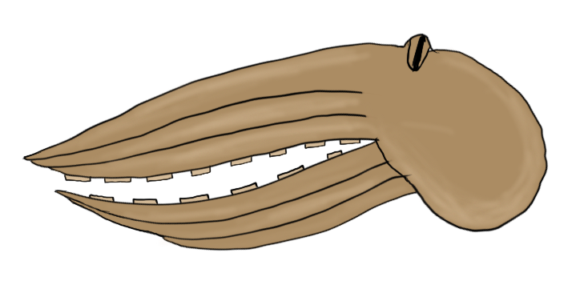
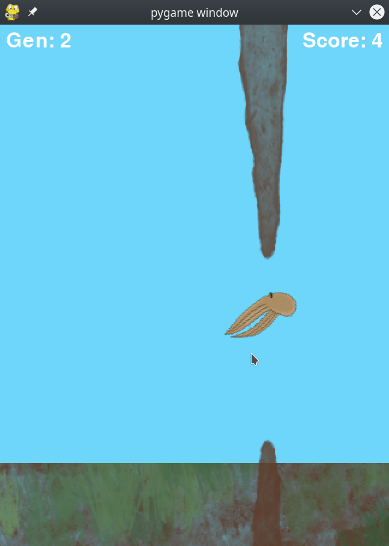
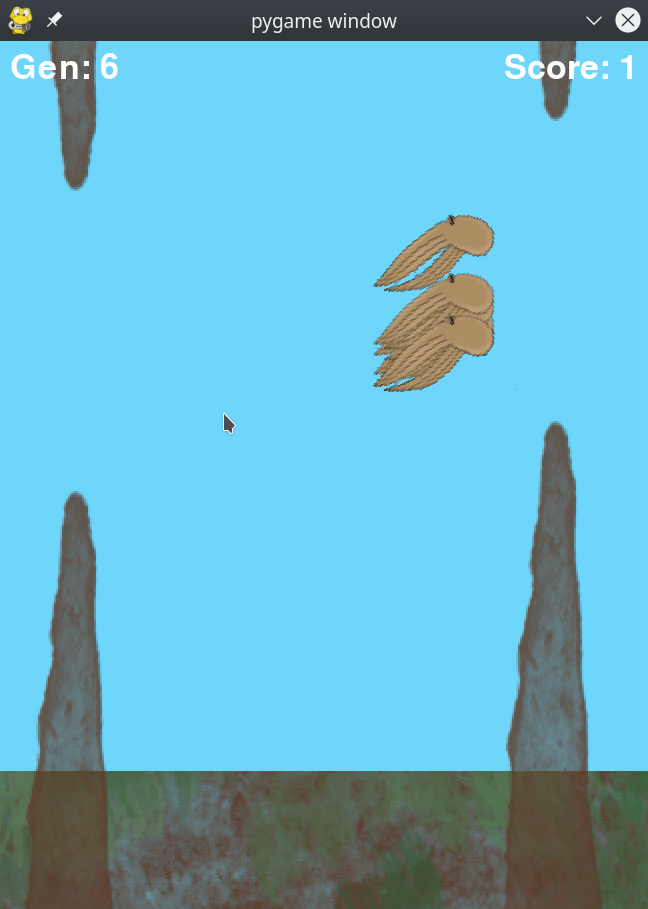

# OctopAI

This is a simple obstacle avoidance game which I will use to test different algorithms. The octopAI is a base to develop different algorithms that help an AI octopus to traverse the perils of the underwater world.

In this first version, the [NEAT genetic algorithm](https://neat-python.readthedocs.io/en/latest/index.html) is used to train the neural net model. The file config-feedforward.txt contains the configuration of the Neural network and the genetic algorithm that trains and modifies it. The visuals are developed using the Pygame module.

The main motivation and the initial version of the code comes from the tutorial from the Tech with Tim YouTube channel that can be found in [this playlist](https://www.youtube.com/playlist?list=PLzMcBGfZo4-lwGZWXz5Qgta_YNX3_vLS2) that develops makes the AI play a FlappyBird game.

 Some screen shots from OctopAI 

 The initial version of the project contains the code developed while following the FlappyBird tutorial with custom visuals I developed. 

