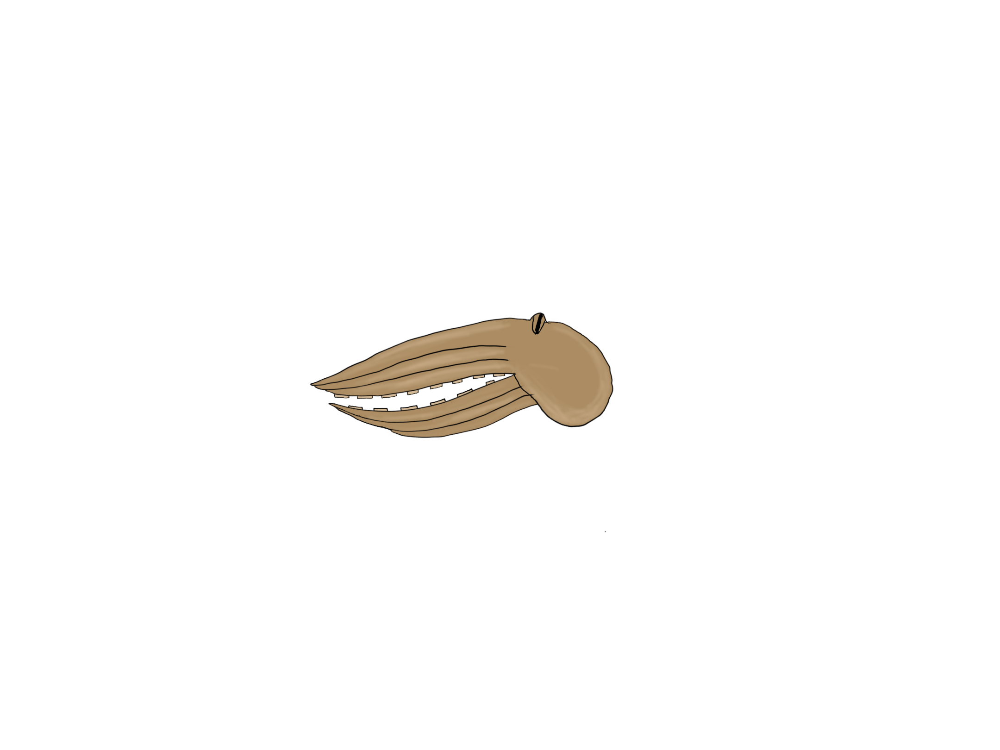

# OctopAI
This is a simple obstacle avoidance game which I will use to test different algorithms

The octopAI is a base to help an AI octopus to traverse the perils of the underwater world.

In this first version, the NEAT genetic algorithm is used to train the neural net model
https://neat-python.readthedocs.io/en/latest/index.html

The main motivation and the initial version of the code comes from the tutorial from the Tech with Tim YouTube channel that can be found in this playlist: https://www.youtube.com/playlist?list=PLzMcBGfZo4-lwGZWXz5Qgta_YNX3_vLS2

